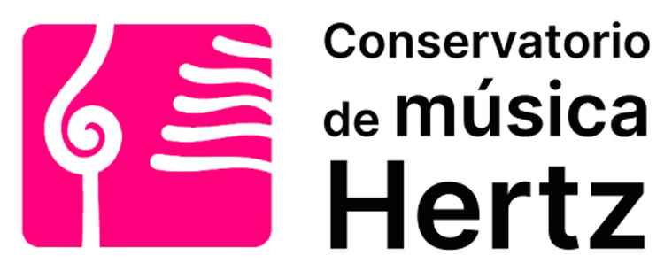

# Repositorio Frontend
# Proyecto Web Conservatorio de Música Hertz - Experiencia IT

Proyecto de institución educativa
Plataforma web de un instituto de música
Para el público en general se presenta un Home Page y sus subsecciones
- Información sobre actividades
- Propuesta que ofrece el conservatorio
Para Alumnos, Docente y empleados:
- Acceso a plataforma con permisos exclusivos para realizar sus principales flujos

## Tecnologías:
FrontEnd:
React.Js  
   
BackEnd: 
Node.Js  
   
Repositorio: 
GitHub  
   
Archivo:
Google Drive  
   
Servidor:
- Linux Distribución: Ubuntu 22   
   
- Base de Datos: MySQL   

### Otra herramientas usadas
NginX   
   
Dockers   
  
Bash   
  
